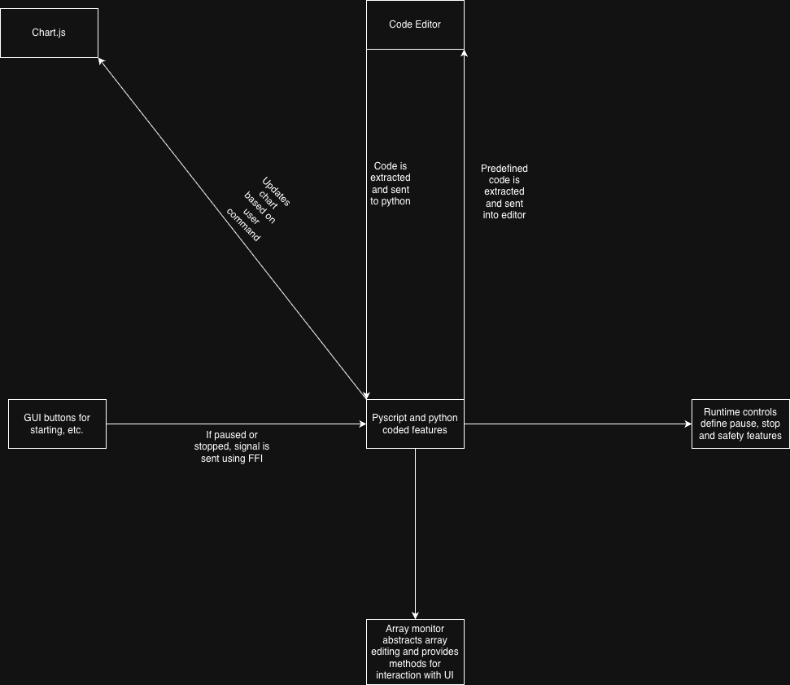

## What This Program Is
This program is a web-based algorithm visualizer coded in HTML, CSS, JavaScript, and Python

Features
- Code array based algorithms in python, including sorting and searching
- See how algorithms affect an array using a visualizer
- Being able to program additional information to be sent. For example, you can display the key in an insertion sort within the step context window

## Technical Architecture

Pyscript is what runs any user defined or custom algorithm and is the core of our visualizer. We use pyscript and pyodide in order to interface with any javascript components like the user interface, code editor, and chart.js. 

The array abstraction layer of Pyscript provides array modifications using a python list attribute, several methods for updating chart.js, and other attributes which gives extra info like the Step Context. 
GUI buttons include pausing, starting, etc which uses a python method (executed in javascript using the Pyscript FFI) and halts the algorithm until the user wants to continue. It also provides several safety features like a max step count.

THe code editor (made using CodeMirror) is the one feature that communicates both ways with pyscript. Code is sent from the editor into pyscript for execution and our predefined algorithms' code is extracted using pyscript, sent into a javascript string, manipulated, then displayed. To allow tabbing (especially since python is indent heavy), CodeMirror provides an option to handle it.

Chart.js is the library that handles rendering the array in a pleasing manner. We use a bar chart to display everything, which especially helps with sorting. D3.JS was an option we were considering however we went with chart.js since its more abstract. We also allow the user to send additional strings to a different part of the UI and also provide the ability to set indices certain colors.

## Installation Instructions
How to run locally
- Install npm and git onto your machine
- Use git to clone the repo
- Within the repo folder, run `npm i` in order to install all the dependencies 
- Run the application with `npm run dev` within the repo folder
- Go to the specified localhost page that the command displays. for example `http://localhost:5173/` 

## Group Members and Their Roles

- Aryan Patel: Editor integration, any bug fixes relating to it, and AI integration
- Ibrahim Tayeb: Chart.js integration, Piecing all the components together, designing algorithms
- Simon Piwcewicz: Project setup and management, Array abstraction layer, refacorting work to improve code quality
- Shiv Bhavsar: CI research, setup, and deployment. Keeping CI update as project continues to evolve
